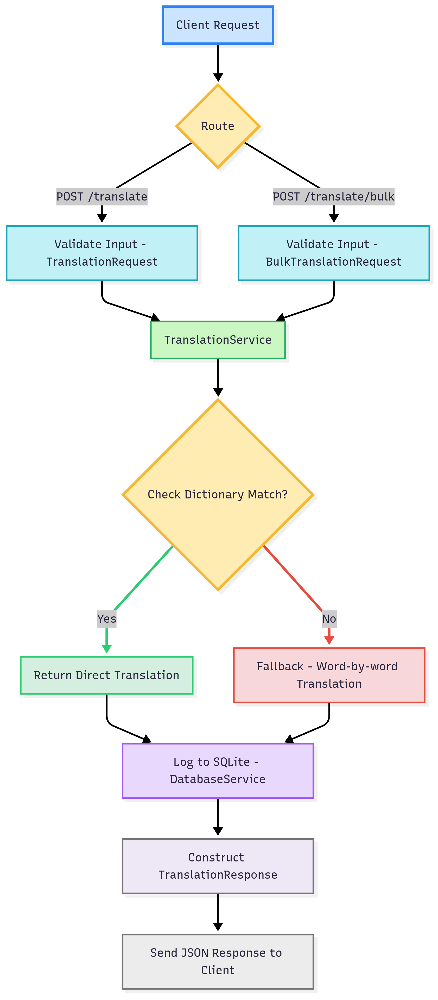

<div align="center">

# 🌍 Translation Microservice

### FastAPI-powered Multi-Language Translation API

[](https://fastapi.tiangolo.com/)
[](https://www.python.org/)
[](https://www.docker.com/)
[](https://sqlite.org/index.html)

**Translate text effortlessly using clean APIs and a scalable backend**
*Single • Bulk • Logged • Validated • Extendable*

[📖 Docs](#-api-endpoints) • [🛠️ Docker Setup](#-docker-deployment) • [⚙️ Architecture](#-project-architecture) • [📂 Directory Structure](#-directory-structure)

</div>

---

## ✨ Features

✅ REST API for single and bulk translation
🌐 Supports multiple languages: Tamil (`ta`), Hindi (`hi`), Kannada (`kn`), Bengali (`bn`)
🧪 Input validation with Pydantic
📚 SQLite logging for audit/history
📦 Dockerized for easy deployment
💥 Structured, scalable codebase
📡 Health check endpoint

---

## 🚀 Quickstart

### 📥 Installation

```bash
git clone https://github.com/your-username/ProjectUdaan.git
cd ProjectUdaan
pip install -r requirements.txt
```

### ▶️ Run Locally

```bash
python main.py
```

### 🐳 Run with Docker

```bash
docker-compose up -d
```

---

## 🧭 Translation Flow

<div align="center">
  
</div>

---

## 🧪 Sample API Requests

### 🔹 Single Translation

```json
POST /api/v1/translate
{
  "text": "Hello",
  "target_language": "ta"
}
```

### 🔹 Bulk Translation

```json
POST /api/v1/translate/bulk
{
  "texts": ["Hello", "Goodbye"],
  "target_language": "hi"
}
```

---

## 📘 API Endpoints

| Method | Endpoint                    | Description              |
| ------ | --------------------------- | ------------------------ |
| `POST` | `/api/v1/translate`         | Translate a single text  |
| `POST` | `/api/v1/translate/bulk`    | Translate multiple texts |
| `GET`  | `/api/v1/translate/history` | Fetch translation logs   |
| `GET`  | `/api/v1/health`            | Health check endpoint    |

---

## 🏗️ Project Architecture

### 🧩 Core Components

| Component   | Description                                           |
| ----------- | ----------------------------------------------------- |
| `main.py`   | Entry point, sets up FastAPI app and includes routers |
| `routes/`   | Contains API endpoints for translation and health     |
| `services/` | Business logic for translation and database handling  |
| `models/`   | Pydantic schemas for request/response                 |
| `utils/`    | Helpers for language validation and sanitization      |
| `config/`   | Environment and settings management                   |
| `tests/`    | Unit tests for translation logic                      |

---

## 📁 Directory Structure

```
TranslationMicroservice/
├── config/
│   └── settings.py
├── models/
│   └── translation_models.py
├── routes/
│   ├── health_routes.py
│   └── translation_routes.py
├── services/
│   ├── database_service.py
│   └── translation_service.py
├── utils/
│   ├── language_utils.py
│   └── validation_utils.py
├── tests/
│   └── test_translation_service.py
├── Dockerfile
├── docker-compose.yml
├── main.py
├── requirements.txt
└── README.md
```

---

## 🛠️ Production Considerations

1. 🔌 Integrate Google Translate API or OpenAI multilingual models
2. 🛢️ Replace SQLite with PostgreSQL or MongoDB
3. 🔐 Implement JWT-based authentication
4. 🚫 Add rate limiting & abuse protection
5. 📊 Monitoring with Prometheus + Grafana
6. ⚙️ CI/CD for automated testing and deploys

---

## 🧼 Developer Tips

### Clear `__pycache__` if issues occur:

```bash
find . -type d -name "__pycache__" -exec rm -r {} +
```

**On Windows:**

```powershell
Get-ChildItem -Recurse -Include __pycache__ | Remove-Item -Recurse -Force
```

---

<div align="center">

## ❤️ Built for Project Udaan

**Modular • Minimal • Maintainable**

---

**Give it a ⭐ if you found this helpful!**

</div>

---
